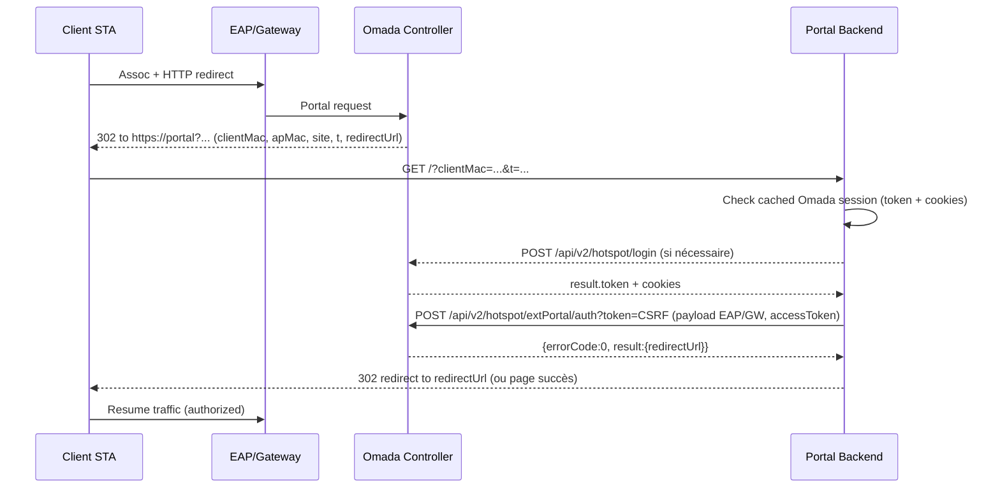

# G1.3 — Omada External Portal (FAQ 2907)

Ce mémo résume les échanges nécessaires entre notre portail et l’API Omada v5.15.x pour le mode “External Portal” décrit dans la FAQ 2907.

## Vue d’ensemble

1. **Redirection initiale** depuis le contrôleur vers `https://PORTAL/?clientMac=...` (Paramètres GET signés).
2. **Authentification opérateur** : `POST /api/v2/hotspot/login` avec les credentials `Operator` ou un compte Admin/service. Retourne `result.token` (CSRF) + cookies (`JSESSIONID`, `Omada_Application_*`, `csrfToken`).
3. **Autorisation client** : `POST /api/v2/hotspot/extPortal/auth?token=<CSRF>` avec le payload (EAP → `apMac`, Gateway → `gatewayMac` / `vid`).
4. **Réponse Omada** : `{"errorCode":0,"msg":"success","result":{"authCode":"...","redirectUrl":"..."}}`. Rediriger ensuite vers `redirectUrl` ou vers la page captive.

Les cookies et le token CSRF doivent être stockés dans un cookie jar partagé. Tant que la session reste valide (`errorCode=-2010` ou HTTP 401 ⇒ session expirée), on réutilise les mêmes cookies. Sinon, on retente `hotspot/login`.

## Paramètres de redirection (`GET /portal`)

Paramètres typiques transmis au portail externe:

| Paramètre | Description |
| --- | --- |
| `clientMac` | Adresse MAC du STA (format `AA-BB-CC-DD-EE-FF`). |
| `apMac` \| `gatewayMac` | MAC de l’AP ou de la passerelle (selon site). |
| `site` | UUID Omada du site. |
| `radioId` | Radio (0=2.4GHz, 1=5GHz, 2=6GHz). |
| `ssidName` \| `vid` | SSID pour EAP / VLAN ID pour Gateway. |
| `t` | Timestamp µs (utilisé dans la signature). |
| `redirectUrl` | URL finale à atteindre après auth. |
| `authType` | `4` pour Portail externe (Token). |

Le portail doit conserver ces valeurs pour les relayer à `extPortal/auth`.

## Accounting RADIUS (comportement Omada)

Lorsque le portail est configuré avec :

- `Authentication Type = RADIUS Server`, et
- `Portal Customization = External Web Portal` (HTTP ou HTTPS),

le contrôleur Omada continue de jouer le rôle de NAS RADIUS :

- Authentification : émission des `Access-Request` / `Access-Accept` / `Access-Reject` vers FreeRADIUS/RadiusDesk.
- Accounting : envoi des paquets `Accounting-Request` (Start / Interim‑Update / Stop) vers FreeRADIUS/RadiusDesk.

Conséquences pour RadiusDesk :

- Les tables `radacct` et `MacUsages` restent la source d’autorité pour l’usage (temps/data), comme en portail local.
- Les profils simple/advanced/FUP (`Rd-*`) et la logique de quotas ne nécessitent aucun changement de schéma.

## Configuration Omada ↔ portail externe

- **URL External Web Portal** : renseigner dans Omada l’URL publique du portail React/Node, par exemple la valeur de `PORTAL_PUBLIC_URL` (racine du frontend).  
- **HTTPS / HTTP** :
  - En lab : `http://…` possible si le contrôleur Omada l’autorise.
  - En production : privilégier `https://…` avec certificat valide (conforme à la politique TLS de l’infra).
- **Backend Node** :
  - La variable d’environnement `OMADA_EXTERNAL_PORTAL_ENABLED` (voir `backend/src/config.ts`) permet d’activer/désactiver l’appel `extPortal/auth` côté backend.
  - Quand ce flag est `true`, le backend appelle `POST /api/v2/hotspot/extPortal/auth` après validation des identifiants via RadiusDesk.

## Étape 1 — Auth opérateur

```
POST https://omada.techzone.lat:8043/api/v2/hotspot/login
Content-Type: application/json

{ "name": "Operator", "password": "Operator@123" }
```

- Réponse: `{"errorCode":0,"msg":"Success","result":{"token":"751c...","roleType":2,...}}`.
- Cookies reçus: `JSESSIONID`, `Omada_Application_Id`, `csrfToken`.
- Le header `Csrf-Token` n’est pas requis; le token est fourni via query `?token=...`.

**cURL (avec cookie jar)**:

```bash
curl -k -sS "https://omada.techzone.lat:8043/api/v2/hotspot/login" \
  -c /tmp/omada.jar \
  -H "Content-Type: application/json" \
  --data '{"name":"Operator","password":"Operator@123"}'
```

Conserver `result.token` pour les appels suivants.

## Étape 2 — Autorisation client

```
POST https://omada.techzone.lat:8043/api/v2/hotspot/extPortal/auth?token=<CSRF>
Content-Type: application/json
Cookie: (depuis /tmp/omada.jar)
```

### Payload EAP (SSID)

```json
{
  "clientMac": "AA-BB-CC-DD-EE-FF",
  "apMac": "11-22-33-44-55-66",
  "site": "e8f65d62-...",
  "radioId": 1,
  "ssidName": "Guest-WiFi",
  "authType": 4,
  "time": 1730488745123123,
  "accessToken": "radiusdesk-ticket-id",
  "redirectUrl": "https://example.com/success"
}
```

### Payload Gateway (VLAN)

```json
{
  "clientMac": "AA-BB-CC-DD-EE-FF",
  "gatewayMac": "66-55-44-33-22-11",
  "site": "e8f65d62-...",
  "radioId": 0,
  "vid": 20,
  "authType": 4,
  "time": 1730488745123123,
  "accessToken": "voucher-or-token",
  "redirectUrl": "https://example.com/success"
}
```

- `accessToken` = jeton généré par notre backend (ex: identifiant de session RADIUSDesk/Voucher). C’est la valeur renvoyée à Omada pour tracer l’utilisateur.
- `time` doit être le même horodatage µs que la redirection initiale (`t`). Omada rejette les requêtes si l’écart > 3 min (`errorCode=4700`, `msg="timeout"`).

**cURL EAP**:

```bash
curl -k -sS "https://omada.techzone.lat:8043/api/v2/hotspot/extPortal/auth?token=$CSRF" \
  -b /tmp/omada.jar -c /tmp/omada.jar \
  -H "Content-Type: application/json" \
  --data '{
    "clientMac":"AA-BB-CC-DD-EE-FF",
    "apMac":"11-22-33-44-55-66",
    "site":"e8f65d62-...",
    "radioId":1,
    "ssidName":"Guest-WiFi",
    "authType":4,
    "time":1730488745123123,
    "accessToken":"rd-permuser-demo",
    "redirectUrl":"https://portal.example/success"
  }'
```

Réponse succès:

```json
{
  "errorCode": 0,
  "msg": "Success",
  "result": {
    "authCode": "ce8b4a6a6514****",
    "redirectUrl": "https://portal.example/success"
  }
}
```

## Gestion des cookies & rafraîchissement

- **Cookie jar partagé** : utiliser la même `cookieJar` (fichier ou stockage en mémoire) pour toutes les requêtes. Les cookies incluent le `csrfToken` et une session JSESSIONID.
- **Expiration** : si `errorCode=-2010` ou HTTP 401/440, relancer `hotspot/login` + rejouer l’appel ayant échoué. Stocker le timestamp du login pour savoir quand rafraîchir (ex: TTL 1h par défaut).
- **Concurrence** : un seul login partagé suffit; si échec (par ex. “invalid token”), verrouiller la régénération pour éviter plusieurs logins simultanés.
- **TLS** : l’API exige HTTPS valide (certificat wildcard). Utiliser `-k` uniquement en lab.

## Codes d’erreur courants

| Code | Interprétation |
| --- | --- |
| `0` | Succès. |
| `-2010` | Session invalide / CSRF expiré → relogin. |
| `-2011` | Credentials incorrects. |
| `4700` | Timestamp `time` trop vieux / mismatch. |
| `4800` | Signature invalide (paramètre manquant, MAC non reconnu). |
| `5000` | Erreur serveur (logs Omada). |

## Séquence complète



## Stratégie côté backend

- Conserver `result.token`, `JSESSIONID`, `csrfToken` et `Omada_Application_*` en mémoire (Redis) avec TTL.
- Implémenter un middleware qui:
  1. Récupère la session active (sinon login).
  2. Envoie `extPortal/auth`.
  3. Sur `401` ou `errorCode=-2010`, supprime la session, relogin et rejoue l’appel.
- Logger `clientMac`, `site`, `authType`, `authCode` pour la traçabilité.
- Contrôler `time` avec `Date.now()*1000` (µs) pour rester synchronisé (<3 min).

Ces éléments couvrent les exigences du prompt G1.3 : description des appels, gestion des cookies/token CSRF, exemples `curl` (login, auth EAP/Gateway) et diagramme de séquence illustrant le flux complet.
